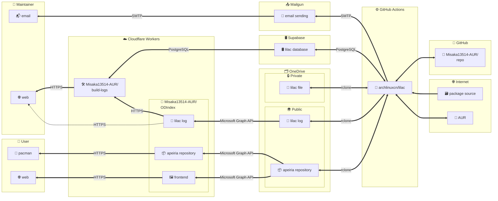

# Misaka13514-AUR/repo

This repository is an [unofficial Arch Linux user repository](https://wiki.archlinux.org/title/Unofficial_user_repositories), contains [the packages I maintain or co-maintain in AUR](https://aur.archlinux.org/packages/?K=Misaka13514&SeB=M), and many other packages that I use.

Powered by [lilac](https://github.com/Misaka13514-AUR/lilac).

[](https://aur.archlinux.org/account/Misaka13514)
[](https://github.com/Misaka13514-AUR/repo/blob/main/LICENSE)

## Usage

Add the following lines to `/etc/pacman.conf`:

```ini
[apeiria]
# Primary server
# User -> OneDrive (Redirected by Cloudflare)
Server = https://aur.apeiria.net/$arch

# Experimental server (may improve connectivity in some regions)
# User -> Cloudflare -> OneDrive
Server = https://aur-cloudflare.apeiria.net/$arch
# User -> Fastly -> Cloudflare -> OneDrive
Server = https://aur-fastly.apeiria.net/$arch
```

Add my GPG key to the pacman keyring and trust it:

```sh
sudo pacman-key --recv-keys 293B93D8A471059F85D716A65BA92099D9BE2DAA
sudo pacman-key --lsign-key 293B93D8A471059F85D716A65BA92099D9BE2DAA
```

Web index: https://aur.apeiria.net/x86_64/  
Archived packages: https://aur.apeiria.net/archive/  
Build logs: https://build.apeiria.net/

## Issues

* Flag package OUT-OF-DATE by submitting new issues (please follow the template).
  * If the new release is within less than a day, please be patient and wait for up to one day; our bot is likely going to build a new one soon.
* If there is something wrong with provided packages, please submit issues of desired type.

## Security

Not all packages in this repository are the same as those in AUR, they have not been thoroughly vetted. Any use of the provided files is at your own risk.

If you find any security issues, please report them to me via email: Misaka13514 at gmail dot com.

### Package Integrity

#### GPG Key (Web of Trust–based trust model)

Packages are signed with my GPG key:

```sh
$ gpg --list-keys --with-subkey-fingerprint Misaka13514
pub   ed25519 2023-01-01 [SC] [expires: 2030-01-01]
      293B93D8A471059F85D716A65BA92099D9BE2DAA
sub   cv25519 2023-01-01 [E] [expires: 2030-01-01]
      60B8CFF2C1E82F6B2627A1D76B71F8EC272CFDCF
sub   ed25519 2023-01-01 [A] [expires: 2030-01-01]
      64EBC7BB5FCB344C088D8E11FB305A6788613226
sub   ed25519 2023-01-01 [S] [expires: 2030-01-01]
      D633F6584ECB7AD762166144B4F6D57F0FC9507E
```

The subkey with the fingerprint `D633F6584ECB7AD762166144B4F6D57F0FC9507E` is used by GitHub Actions to sign built packages automatically. I will revoke this subkey if it is ever compromised.

The signature is verified by `pacman` by default when you install the package. You can verify the signature manually by running the following command:

```sh
$ gpg --verify path/to/package.pkg.tar.zst.sig path/to/package.pkg.tar.zst
```

#### GitHub Attestation (Hosted CI-based trust model)

All packages are built on GitHub Actions. Attestations are published as verifiable provenance and integrity guarantees for each build.

These packages meet the requirements for SLSA v1.0 Build Level 2. You are encouraged to review the build instructions and [verify the attestation](https://docs.github.com/en/actions/security-for-github-actions/using-artifact-attestations/using-artifact-attestations-to-establish-provenance-for-builds) before trusting the result:

```sh
$ gh attestation verify -R Misaka13514-AUR/repo path/to/package.pkg.tar.zst
```

### Repository Availability

The repository is completely built with free platforms (see [Architecture](#architecture)). If any of them goes down, or the repository is attacked, the repository will be unavailable. I will try my best to keep the repository online, but I cannot guarantee it.

If you are concerned about the availability of the repository, you can mirror it to your own server: [OneDrive share link (read-only)](https://lockinwize-my.sharepoint.com/:f:/g/personal/misaka13514_lockinwize_onmicrosoft_com/Es6uIZIqFmVEs2LgpOy6MUQB_hGYl6_LV-K2rO8SwkIijA).

All files in the repository are stored on OneDrive, which is scanned by Microsoft for malware and viruses. Seems I cannot bypass this scan, if there is a false positive (e.g. `nuclei-templates` is flagged because there is webshell in it), you will need to download the file manually from the OneDrive share link above, and then install it with `pacman -U`.

## Architecture



If you are interested in building your own repository with GitHub Actions without using lilac, you can check out the following projects:
  - [clansty/arch-build](https://github.com/clansty/arch-build)
  - [arch4edu/cactus](https://github.com/arch4edu/cactus)

## Acknowledgments

Thanks to all contributors:

[](https://github.com/Misaka13514-AUR/repo/graphs/contributors)

Thanks to the following projects and services for their support:

- [Arch Linux](https://archlinux.org)  
  The best Linux distribution.

- [AUR](https://aur.archlinux.org)  
  World's largest software repository maintained by thousands of users like me.

- [archlinuxcn/lilac](https://github.com/archlinuxcn/lilac)  
  The build bot. Thanks to [@lilydjwg](https://github.com/lilydjwg) for developing it.

- [GitHub](https://github.com)  
  Platform for hosting the code and [CI/CD](https://github.com/Misaka13514-AUR/repo/actions).

- [Cloudflare](https://www.cloudflare.com)  
  CDN and serverless platform.

  - [Misaka13514-AUR/ODIndex](https://github.com/Misaka13514-AUR/ODIndex) Proxy for the OneDrive API.
  - [Misaka13514-AUR/build-logs](https://github.com/Misaka13514-AUR/build-logs) Provide lilac build logs. Thanks to [@imlonghao](https://github.com/imlonghao) for the [original code](https://github.com/imlonghao/archlinuxcn-packages).

- [OneDrive](https://onedrive.com)  
  5TB cloud storage for hosting the packages. Thanks to [@mzwing](https://github.com/mzwing) for providing the E5 subscription.

- [Supabase](https://supabase.com)  
  Database for storing the lilac build logs.

- [Mailgun](https://www.mailgun.com)  
  Email service for sending lilac error reports.

- [Fastly](https://www.fastly.com)  
  Optional CDN for serving the packages.
